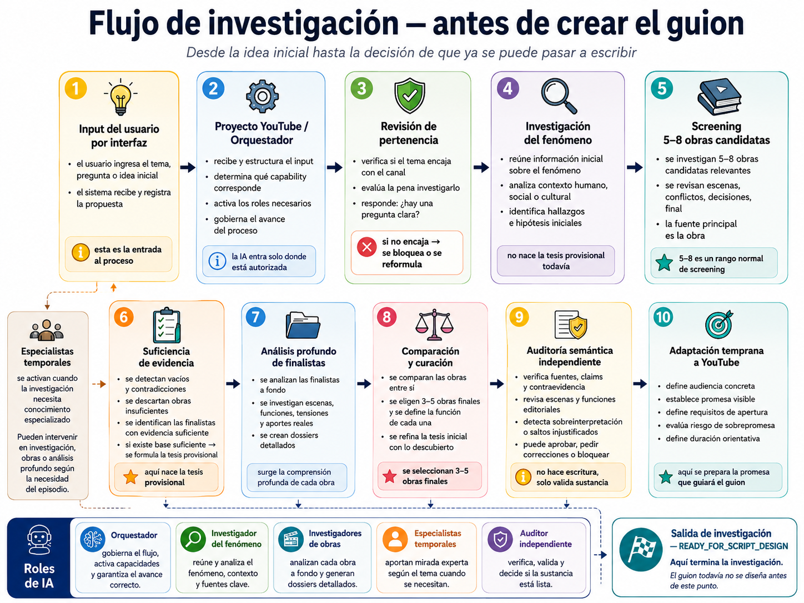
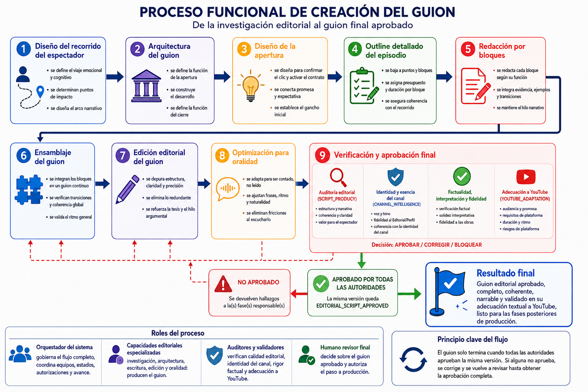

# MVP baseline — Proyecto YouTube

```yaml
mvp_baseline:
  mvp_id: PROYECTO-YOUTUBE-MVP
  canonical_artifact: docs/product/MVP_BASELINE.md
  version: "1.1.1"
  status: DEFINED
  approved_by: OWNER
  approved_at: 2026-07-26
  supersedes: []
  related_delivery_plan:
    artifact: plans/001_reestructuracion_motor_agentico_editorial_y_harness.md
    version: "1.4"
```

## Producto, problema y usuario

El MVP es el núcleo profesional de guiones de Más Allá del Guion: un sistema portable que deja evidencia de un guion hasta el estado **Guion Editorial Aprobado (EDITORIAL_SCRIPT_APPROVED)**, sin diluir la identidad del canal ni depender de un único proveedor. No incluye el paquete de distribución, publicación automática ni una pieza audiovisual final.

Resuelve entradas incompletas, evidencia insuficiente, falsos PASS, contratos incompatibles, aprobaciones sobre una versión distinta y pérdida de coherencia entre bloques. Lo usan el propietario y operadores autorizados; Inteligencia del Canal, Producto Guion y Adaptación a YouTube consumen o auditan salidas en su especialidad, y Gobernanza Técnica gobierna contratos, integración, pruebas y evidencia. La audiencia final del canal no es usuaria del sistema.

## Promesa, capacidades y aceptación

La promesa mínima es completar un flujo trazable desde identidad y brief hasta guion aprobado, incluyendo su adecuación textual a YouTube. Packaging final, Shorts, SEO y distribución se conservan para una segunda etapa que requiere autorización expresa.

| ID | Capacidad obligatoria | Criterio de aceptación y bloques |
| --- | --- | --- |
| MVP-CAP-001 | Consumir EditorialProfile versionado, trazable y aprobado funcionalmente. | MVP-AC-001: identidad preservada y sin documentos sueltos en producción. B3–B4. |
| MVP-CAP-002 | Diseñar brief, tipo, investigación, evidencia, tesis y recorrido trazables. | MVP-AC-002: evidencia insuficiente, vacíos y estados contradictorios no hacen PASS. B1–B2, B5. |
| MVP-CAP-003 | Redactar por bloques con memoria global, ensamblaje reproducible y edición separada. | MVP-AC-003: diseño, redacción, edición y auditoría trazables. B5–B7. |
| MVP-CAP-004 | Auditar evidencia, factualidad, originalidad, oralidad y coherencia. | MVP-AC-003. B5–B7. |
| MVP-CAP-005 | Adecuar textualmente el guion a YouTube, sin deformar la tesis, considerando apertura, duración orientativa, monetización, seguridad publicitaria, copyright y riesgos originados en el texto. | MVP-AC-004: versión editorial exacta y aprobación del guion. B5–B7. |
| MVP-CAP-006 | Versionar, aprobar editorialmente e invalidar ante cambios posteriores. | MVP-AC-004. B1–B2, B7. |
| MVP-CAP-007 | Operar con contratos, gates y pruebas deterministas, portable y configurable por contrato. | MVP-AC-005: tres casos B9 con evidencia de cierre. B1–B2, B9. |

Esta tabla normaliza, sin sustituir, la Definition of Done del Plan 001 §32. El cierre requiere que las validaciones funcionales obligatorias estén aprobadas para la misma versión; que el sistema verifique contratos, invariantes, versionado y consistencia; y que la aprobación editorial humana correspondiente quede registrada por separado. Ninguna de estas capas sustituye a las demás.

## Mapa funcional canónico del MVP





El flujo de investigación termina funcionalmente preparado para el diseño del guion. `READY_FOR_SCRIPT_DESIGN` es una etiqueta funcional visual del mapa, no un nuevo estado contractual. El flujo de creación termina en `EDITORIAL_SCRIPT_APPROVED`. Los diagramas representan comportamiento funcional, no arquitectura técnica: la IA ejecuta la cognición de cada responsabilidad y el sistema gobierna el flujo, los contratos, los gates y la trazabilidad. Packaging final, Shorts, SEO, distribución y producción audiovisual permanecen fuera del MVP.

Reglas de cierre del mapa funcional:

- Un guion redactado, ensamblado o editado no es todavía un guion final aprobado; tampoco basta una auditoría editorial individual.
- Antes de `EDITORIAL_SCRIPT_APPROVED` deben converger las validaciones obligatorias de calidad editorial, identidad del canal, factualidad/interpretación/fidelidad y adecuación textual a YouTube.
- Todas las evidencias de cierre deben corresponder al mismo `artifact_id`, versión y checksum exactos. Una corrección que produzca una nueva versión invalida para el cierre las aprobaciones de la versión anterior y exige revalidación.
- El auditor detecta, documenta y enruta el defecto; la responsabilidad productora corrige y el auditor revalida. No se corrige silenciosamente el artefacto auditado.
- La función de Inteligencia del Canal define y audita identidad contra el `EditorialProfile`; no se convierte por ello en redactor del guion. La adecuación textual a YouTube se valida antes del cierre y no convierte packaging final en parte del MVP.
- El cierre del MVP es únicamente `EDITORIAL_SCRIPT_APPROVED`. Títulos, miniaturas, packaging final, Shorts, SEO, metadatos de distribución y producción audiovisual permanecen fuera del MVP.
- Los diagramas expresan comportamiento funcional aprobado; por sí solos no demuestran que toda la implementación esté materializada, registrada o demostrada en el repositorio.

## Alcance, restricciones y dependencias

El MVP activo termina en `EDITORIAL_SCRIPT_APPROVED`. Packaging final, títulos, miniatura conceptual, Shorts, SEO, metadatos y paquete de distribución pertenecen a la Etapa 2, diferida y no autorizada. Audio se desarrolla en un repositorio independiente y se integrará mediante un contrato futuro versionado. Video queda fuera del alcance de este repositorio.

Se conserva el fuera de alcance del Plan 001 §31: repositorio nuevo, motor multicanal, SaaS, UI completa, publicación automática, base de datos, analítica avanzada, producción visual, podcast, skills externas, subagentes por defecto, cambio de proveedor como objetivo, MCP obligatorio y fine-tuning.

Post-MVP conocido (§31A): Telegram, voz, aplicación web, múltiples proveedores reales, auditoría cruzada entre modelos, evaluación ciega avanzada, análisis estadístico de estilo, aprendizaje automatizado supervisado, métricas avanzadas de YouTube y experimentación A/B. Esta referencia no autoriza su implementación.

Restricciones: portabilidad, independencia de proveedores, aprobaciones humanas, trazabilidad/versionado/invalidation, ausencia de publicación automática y límites de plataforma/runtime. Dependencias críticas: EditorialProfile, contratos, gates, pruebas, aprobaciones funcionales y validación B9.

## Autoridad, estado y trazabilidad

Inteligencia del Canal define identidad, audiencia editorial, promesa, voz y perfil; Producto Guion define el producto narrativo; Adaptación a YouTube define la adecuación textual a plataforma; Gobernanza Técnica valida contratos, pruebas e integración. El propietario y las responsabilidades funcionales aprueban este MVP y cualquier cambio de producto, alcance o aceptación.

Estado: definido mediante esta consolidación; la etapa activa es el núcleo profesional de Guion. El estado operativo vigente, el incremento activo, las auditorías pendientes y la siguiente acción autorizada se mantienen exclusivamente en `plans/001_CONTROL_OPERATIVO.md`. La Etapa 2 requiere autorización expresa del propietario. El cierre principal del MVP es `EDITORIAL_SCRIPT_APPROVED`.

```text
ACTIVE_PRODUCT_STAGE: SCRIPT_CORE
STAGE_2_YOUTUBE_DISTRIBUTION: DEFERRED_NOT_AUTHORIZED
AUDIO_INTEGRATION: EXTERNAL_REPOSITORY_FUTURE_CONTRACT
VIDEO_PRODUCTION: OUT_OF_REPOSITORY_SCOPE
```

Fuentes: Plan 001 v1.4 (§2, §4, §7, §31, §31A, §32), B0, B9, B9.5 y `docs/specifications/B3_editorial_profile_functional_specification.md`. La decisión de alcance fue aprobada por el propietario; la validación funcional y técnica de la implementación permanece separada.

Nota de cambio v1.1.1: se incorporan los mapas funcionales canónicos del MVP como clarificación documental, sin crear una segunda fuente de verdad ni alterar el alcance. El MVP activo termina en `EDITORIAL_SCRIPT_APPROVED`; la adecuación textual del guion a YouTube forma parte del MVP; packaging, títulos, miniatura, Shorts, SEO, metadatos, distribución y producción audiovisual quedan después de `EDITORIAL_SCRIPT_APPROVED` y fuera del MVP. Audio y Video se tratan como productos externos o fuera del repositorio.
